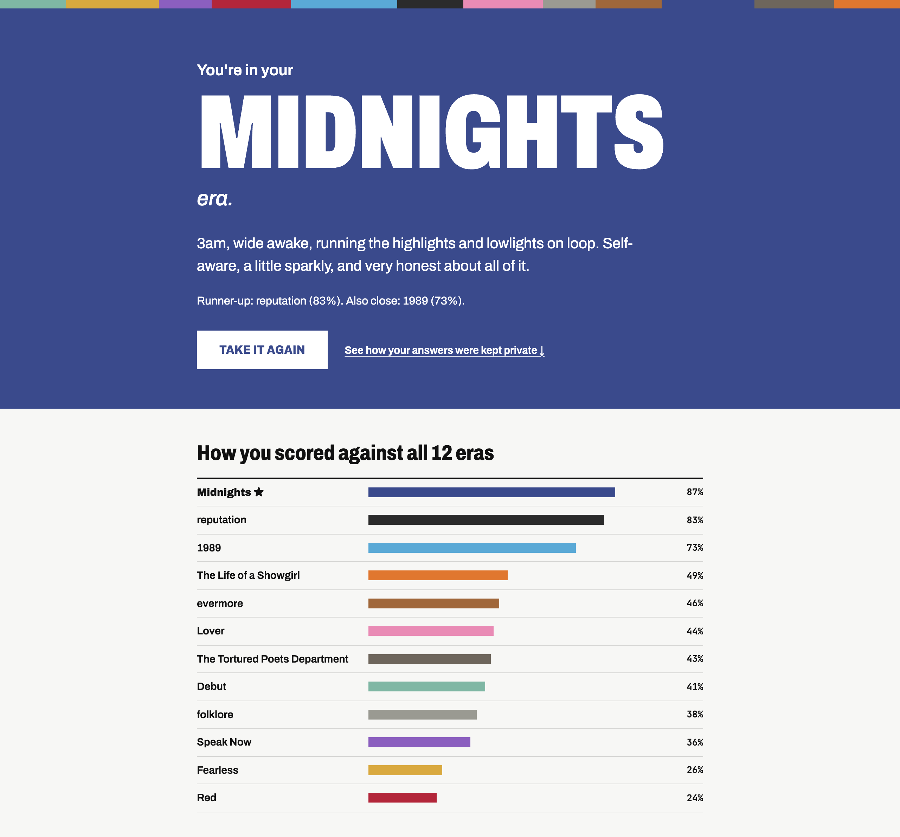

# Which Era Are You?

A fan-made Taylor Swift personality quiz that is scored **without ever being decrypted**. Your twelve answers are encrypted on your computer, scored as ciphertext against twelve era profiles, and only unlocked back on your computer.

- Real CKKS fully homomorphic encryption (OpenFHE, Niobium's instrumented build), ring size 2^16
- Scored locally on plain OpenFHE or on Niobium's FHETCH simulator. A Niobium Fog backend exists in the code but has **not** been tested on the Fog.
- A built-in "proof" view shows the actual ciphertext bytes and the scoring service's own log

Fan-made and unaffiliated with Taylor Swift or her team. Album and era names are used as quiz categories only.



_Generated with the Niobium FHE Application Design AI Assistant (FHEanna)._

## What's private, and from whom

- **Trusted:** the helper program `services/client_service.py` (plus the `era_keygen`, `era_encrypt` and `era_decrypt` programs it runs) on the quiz taker's computer. It is the cryptographic client, not the browser page. The page sends it your answers over the computer's loopback connection.
- **Untrusted (honest-but-curious):** the scoring service, `services/compute_service.py` running `era_server`. It receives only the CKKS crypto context (`cc.bin`), the rotation keys (`rk.bin`) and your encrypted answers, and it returns encrypted scores. It never gets the secret key, the public key, your answers, your trait numbers, your scores or your era.
- **Keys:** one CKKS key pair is generated when the demo starts and is shared by every quiz until it restarts. The secret key lives in an owner-only folder (0700; `sk.bin` is 0600) and is never sent to the scoring service.
- **Local limits:** in this local demo both programs run on the same computer as the same user. They're kept apart by design (what the scoring service is sent, plus a guard that refuses to run if a file named `sk.bin` appears in its folder), not by the operating system. On the Niobium Fog, the scoring hardware is remote.
- **No third-party requests:** fonts are served from `web/fonts/`.

## Run it

You need a native build of [niobium-client](https://github.com/NiobiumInc/niobium-client). The macOS recipe is in DECISIONS.md ("Native macOS build"). Put the checkout next to this folder, or point `NIOBIUM_CLIENT_DIR` at it:

```bash
./build.sh                                              # finds ../niobium-client automatically
NIOBIUM_CLIENT_DIR=/path/to/niobium-client ./build.sh   # or say where it is
./start_local.sh sim
```

When the terminal says `[client] open http://localhost:8000`, open **http://localhost:8000** and take the quiz. Press `Ctrl+C` to stop.

Keep the project out of cloud-synced folders (for example an iCloud Desktop or Documents folder). The demo writes its secret key and ciphertexts under `run_demo/` and `run_*/`, and a sync client would copy them off the machine.

### Choosing where the encrypted math runs

| Command | Encrypted scoring runs on |
|---|---|
| `./start_local.sh sim` | Niobium's FHETCH simulator on this computer (default; a local rehearsal of a Fog run) |
| `./start_local.sh sim-full` | The simulator with a real-math record, plus a bit-for-bit check against plain OpenFHE on every quiz |
| `./start_local.sh cpu` | Plain OpenFHE on this computer's CPU |
| `./start_local.sh fog` | The Niobium Fog. Not verified yet; see **FOG.md** |

The page always says which one produced your result. Only `services/backends.py` knows the difference, and the quiz, encryption and UI are identical in every mode. Port taken? `PORT=8010 COMPUTE_PORT=8011 ./start_local.sh sim`.

On the quiz screen you can answer with the keys A to D (or 1 to 4), and go back with Backspace.

### Tests (no Fog account needed)

```bash
make check
```

That runs, in order:
- `NREC=25 ./run_test.sh --cpu`, `--sim`, `--sim-full`: each prints `PASS` when the decrypted encrypted-path scores match the plaintext twin (tolerance 1e-6, zero era changes). `--sim-full` also prints the bit-for-bit identity check.
- `make unit`: backend layer unit tests, including "the UI never checks for a backend by name".
- `make services`: the real two-process demo for cpu, sim and sim-full, on side ports. It checks:
  - quizzes sent through the services match the twin
  - the open page recovers after compute restarts with an empty home
  - the key guards (no `sk.bin` or `pk.bin` accepted; client home 0700, `sk.bin` 0600)
  - the localhost hardening (browser Origin, foreign Host header and wrong content types refused)

  The first run creates `.venv` with numpy for the twin.

### The Fog

Deliberately left for last. **FOG.md** has the full switch-over checklist, what still needs verifying, and what access to ask Niobium for. `make fog-ready` checks the prerequisites without contacting anything.

## What's in here

```
app/            the four encryption programs (C++, OpenFHE + niobium::compiler)
  keygen.cpp      client: context + keys, written owner-only; the secret key stays in the client home
  encrypt.cpp     client: reads the trait vector on stdin, checks it, packs it into 96 slots, encrypts
  server.cpp      compute: 12 encrypted dot products; --cpu / simulator / Fog
  decrypt.cpp     client: decrypts the 12 scores
  common.hpp      shared slot layout and the ONE circuit function every mode runs
services/
  client_service.py   the trusted local client: serves the page, holds the secret key, encrypts, decrypts
  compute_service.py  the untrusted scoring side: holds no secret key; logs only sizes, timing and a shortened session ID
  backends.py         WHERE the encrypted math runs (cpu / sim / sim-full / fog); the only mode-aware code
tests/              backend unit tests + live two-process service test (make check)
FOG.md              the Fog switch-over: checklist, open questions, access to request
web/            the quiz UI (plain HTML/CSS/JS) and its locally served fonts (web/fonts, SIL OFL 1.1)
data/quiz.json  traits, questions, answer weights, era profiles (single source of truth)
data/eras.csv   the server's plaintext model, exported by tools/twin.py
tools/twin.py   plaintext twin of the encrypted circuit + answer-space sweep
tools/e2e_check.py  random quizzes through the live services vs the twin
run_test.sh     keygen -> encrypt -> server -> decrypt, compared to the twin
DECISIONS.md    design and technical decisions
docs/           the README screenshot
```

`make clean` removes builds, keys and run folders.

## License

Apache License 2.0; see `LICENSE` and `NOTICE`. The fonts in `web/fonts/` are under the SIL Open Font License 1.1 (license texts included there).
